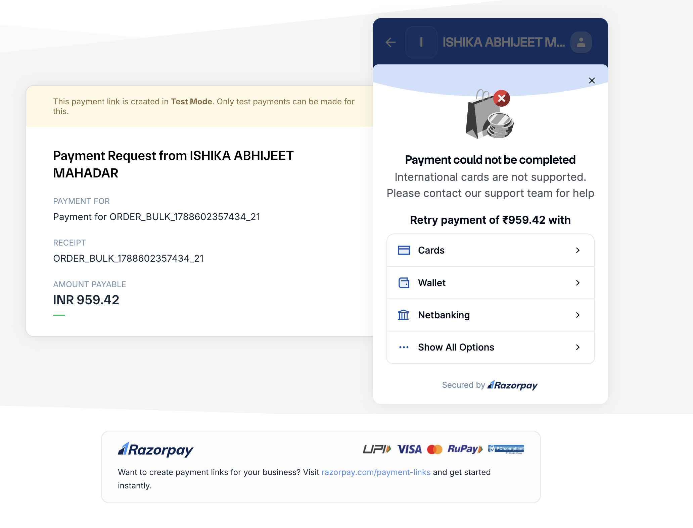
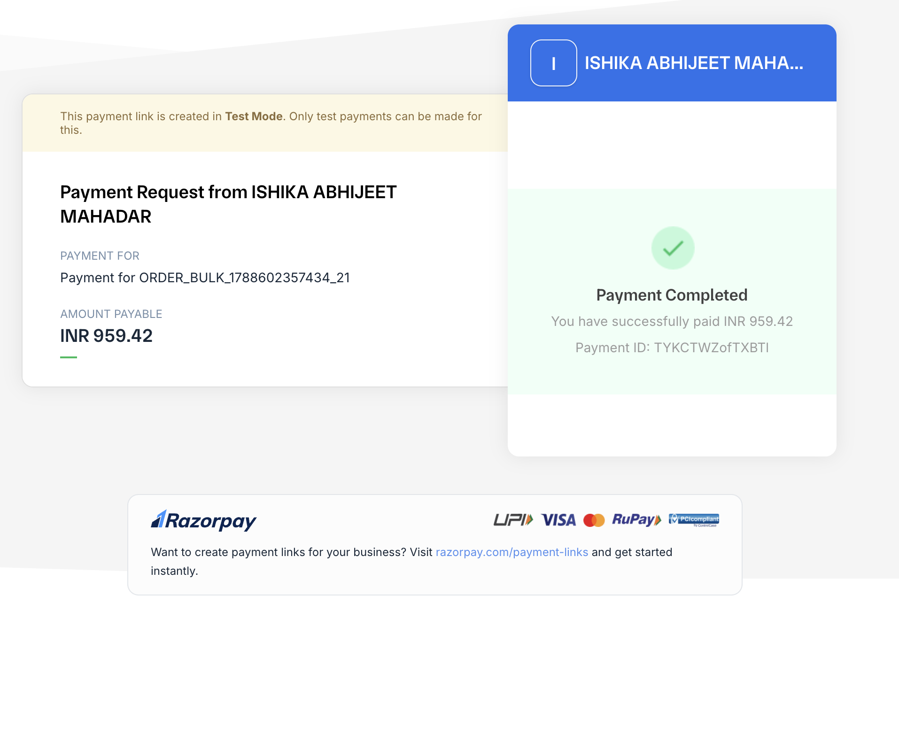

# Real Razorpay payment proof — end-to-end verification

This documents a single real test-mode Razorpay payment, taken all the way
through the live, deployed application — not a simulated outcome, not a
mocked webhook. It backs the claim made throughout the README and the
pitch: the Razorpay integration was verified live, not just unit-tested.

**Obligation:** `ORDER_BULK_1788602357434_21`, ₹959.42
**Payment link:** a real Razorpay test-mode Payment Link, created by
`src/lib/actions/paymentLink.ts` calling the real Razorpay API from the
deployed Vercel app (`https://rzp.io/rzp/aNVpqeI`)

## 1. First attempt — a genuine failure, not staged

The first checkout attempt used a Visa test card number
(`4111 1111 1111 1111`) that Razorpay's test-mode risk checks flagged as
an international card, which this test account doesn't support. This is
included deliberately, not cropped out: it's evidence the checkout is
hitting Razorpay's real payment rails and real validation logic, not a
canned success screen. The fix was switching to Razorpay's documented
India-domestic test card
(`5104 0155 5555 5558`), after which the payment succeeded.

## 2. Successful payment

**Payment ID:** `TYKCTWZofTXBTI`

This matches the payment id Razorpay's webhook reported back to the
application, recorded in this obligation's own audit trail entry:

> `SYSTEM · OBLIGATION_RESOLVED` — "Obligation ORDER_BULK_1788602357434_21
> resolved via razorpay (pay_TYKCTWZofTXBTl) — ₹959.42. Not attributed to
> a specific recovery action — the customer may have paid regardless of
> it."

## What this actually proves

1. **A real Razorpay Payment Link was created** by the deployed app,
   using real `RAZORPAY_KEY_ID`/`RAZORPAY_KEY_SECRET` credentials — not a
   simulated fallback (`deliveryChannel: "razorpay_payment_link"`, not
   `"not_configured"`).
2. **A real customer-facing checkout ran end to end** against Razorpay's
   actual test-mode payment rails, including a genuine validation failure
   and recovery from it.
3. **A real webhook was delivered** from Razorpay to the deployed app's
   `/api/webhooks/razorpay` route, verified against the registered
   `RAZORPAY_WEBHOOK_SECRET` HMAC signature.
4. **The webhook correctly correlated back to the right obligation** by
   `reference_id`/`notes.obligation_id`, and resolved it — moving it from
   `UNPAID` to `PAID`, incrementing `₹ Recovered` on the live dashboard by
   exactly ₹959.42, and (since this obligation had a case with a scheduled
   next action) also writing a `RECOVERY_ACTION_PREVENTED` audit entry,
   cancelling the reminder that would otherwise have gone out to a
   customer who had already paid.

Nothing in this loop — link creation, checkout, webhook delivery,
signature verification, correlation, resolution — was mocked, stubbed, or
run against a local/offline stand-in. All of it happened against the
actual deployed Vercel app and the real Razorpay test-mode API.
